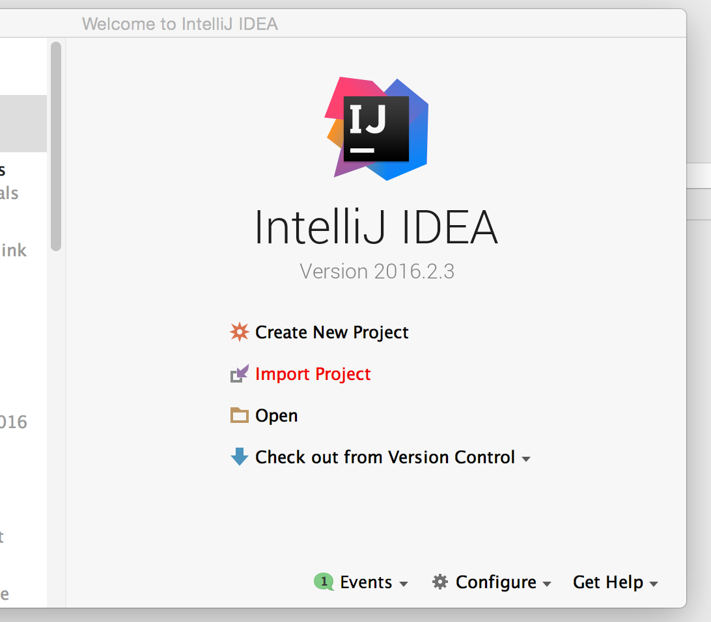
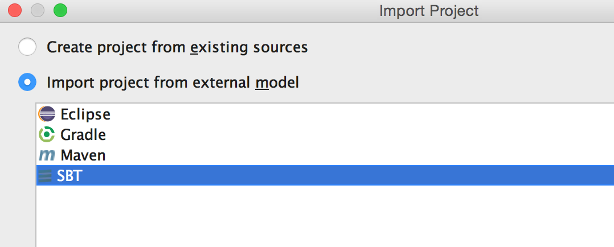
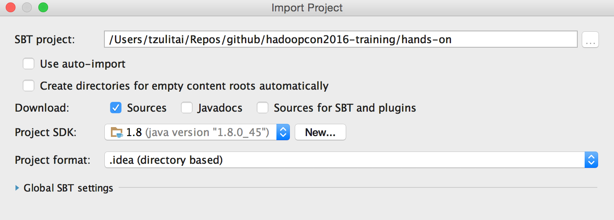
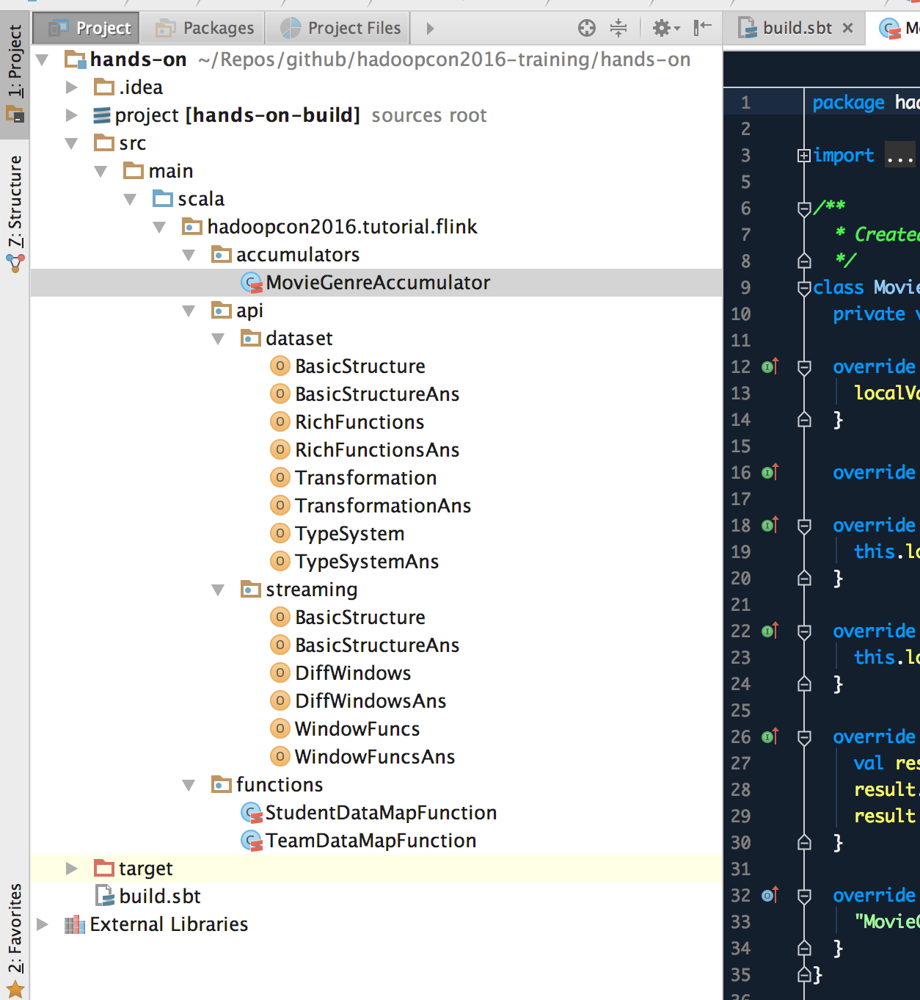

# Apache Flink™ Training Workshop @ HadoopCon2016

This is the training material for the Apache Flink workshop at HadoopCon2016.

Please download the project and import it to your IDE before attending.
You can follow the below instructions to do so, using IntelliJ IDEA as an example.

## Preparation Instructions

First, clone the project:

```
git clone https://github.com/flink-taiwan/hadoopcon2016-training.git
```

Afterwards, import the project into IntelliJ IDEA:



When importing, choose `hadoopcon2016-training/hands-on` as the project root directory. Then, when prompted, you should be able to see that you can import the project using SBT:



Finally, leave all settings as default and simply click the finish button:



The import might take a while as it needs to download all the required dependencies for the first time. After it finishes importing, your project should look something like this:



Congratulations! You are all set ;)

## FAQ

- **Can't find SBT option when importing from external model:** you will need to first install the Scala plugin for IntelliJ IDEA. For more info, see [here](https://www.jetbrains.com/help/idea/2016.2/enabling-and-disabling-plugins.html).
- **No project SDK to choose from when importing:** please first install a Java JDK with version 1.7+.

# Disclaimer

Apache®, Apache Flink™, Flink™, and the Apache feather logo are trademarks of [The Apache Software Foundation](http://apache.org/).
